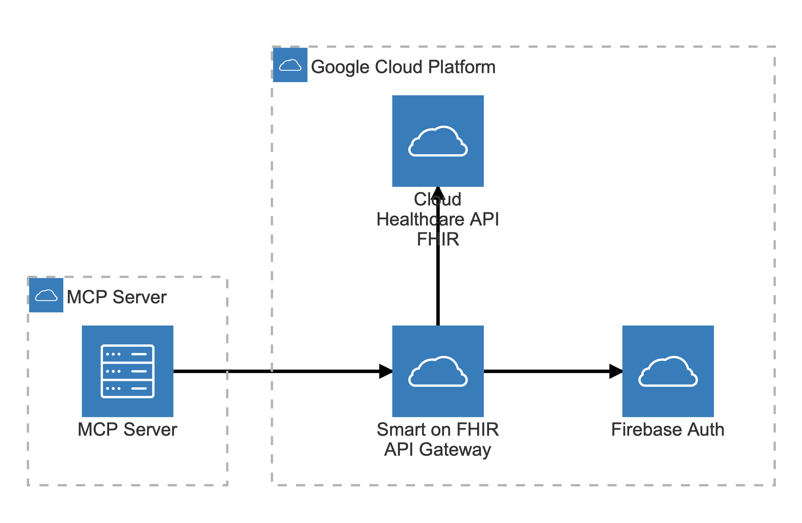
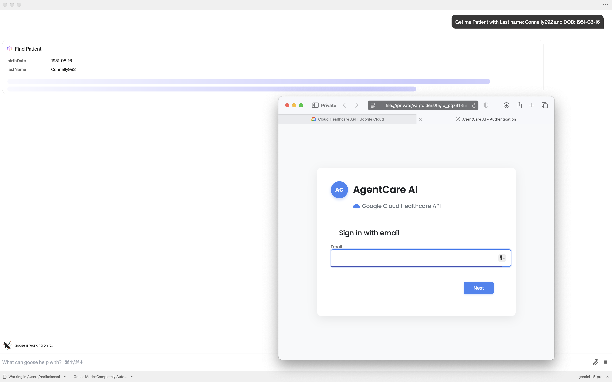
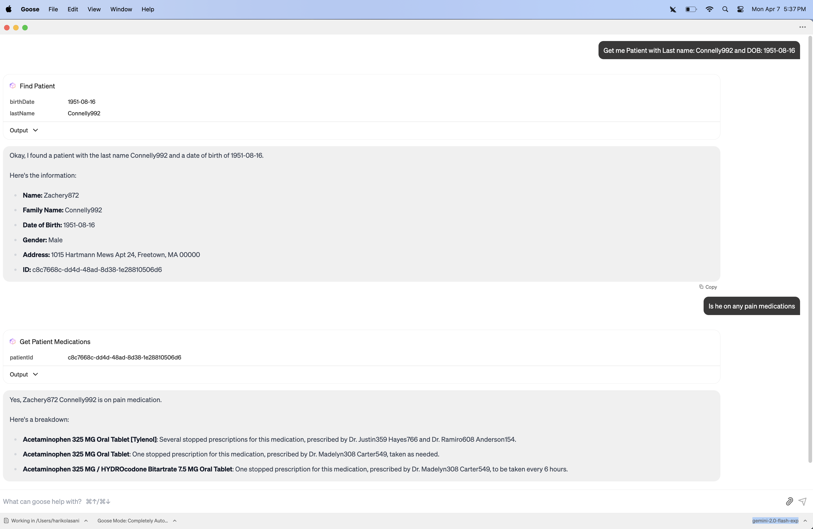
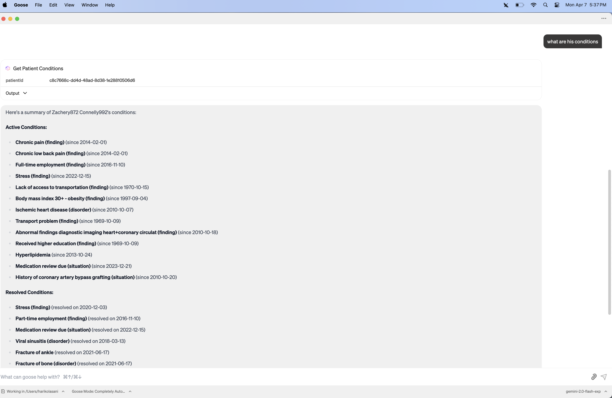
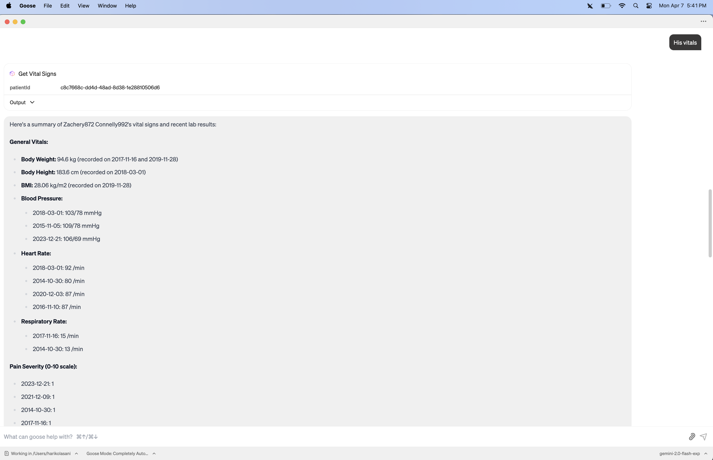
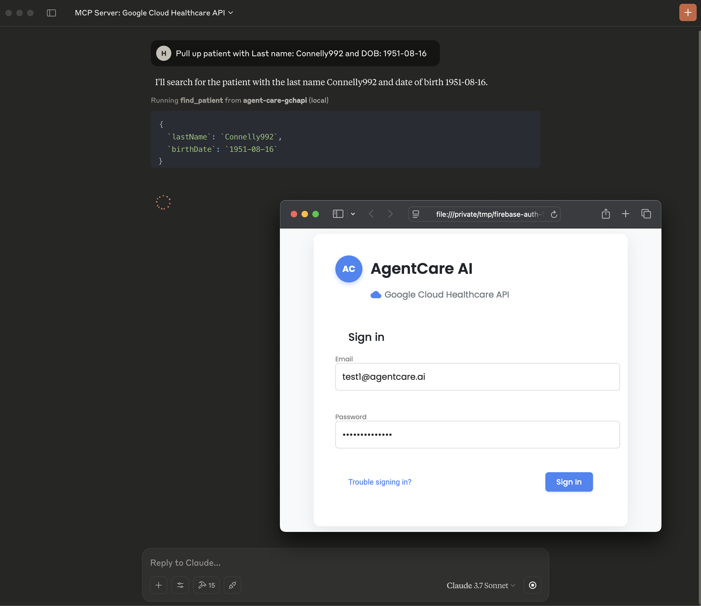
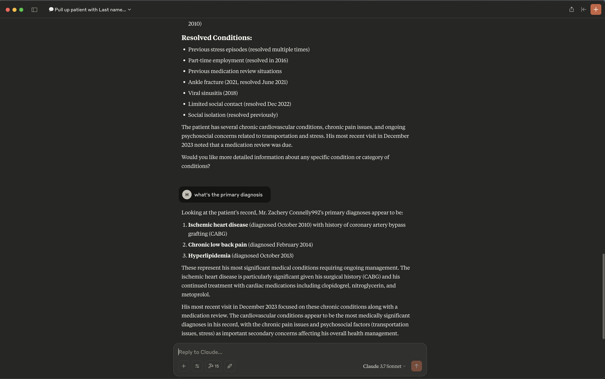
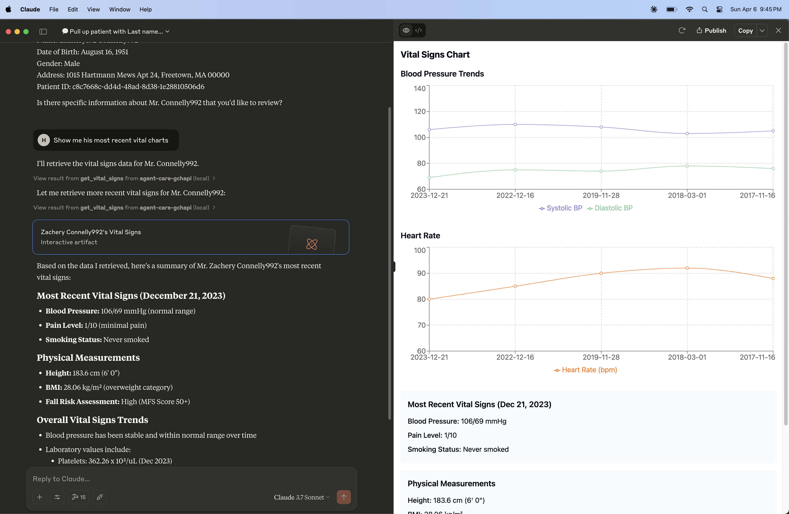
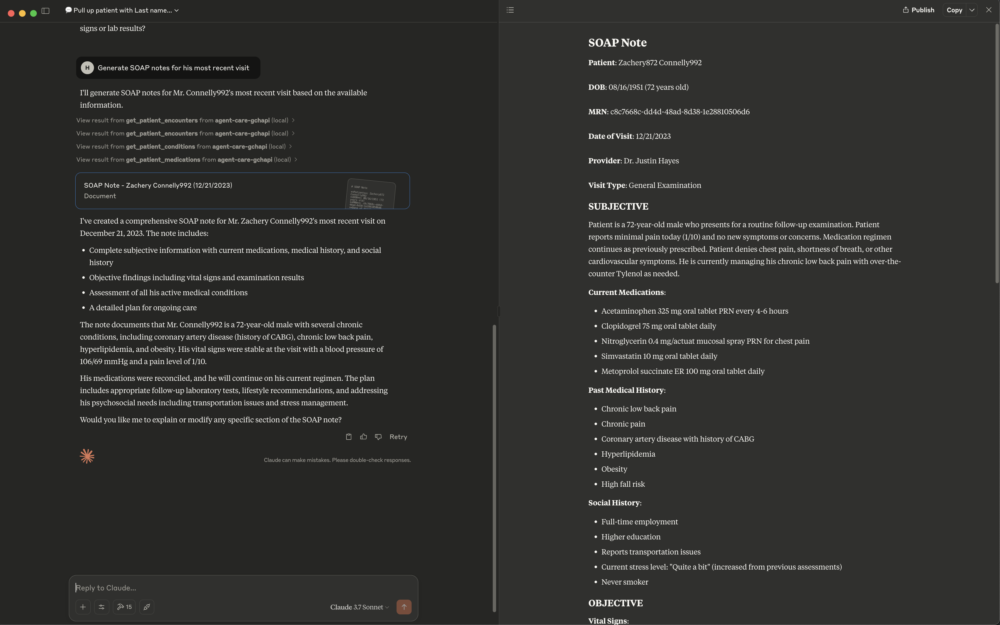

# An MCP Server for Google Cloud Healthcare API (FHIR)

A Model Context Protocol (MCP) server that provides healthcare tools for interacting with FHIR resources on [Google Cloud Healthcare API](https://cloud.google.com/healthcare-api) and public medical research APIs like pubmed, using MCP clients like Claude and Goose.

This is a slightly modified version for AgentCare MCP Server for EHRs. https://github.com/Kartha-AI/agentcare-mcp

The maion differnce is that this repo talks to Google Cloud Healthcare FHIR APIs thru a SmartonFHIR gateway that's secured by Firebase Auth. 

## Architetcure


## Demo
- Claude: demo/claude-demo.mp4
- Goose: demo/goose-demo.mp4

- <video src="demo/goose-demo.mp4" width="500px">Goose</video>
- <video src="demo/claude-demo.mp4" width="500px">Calude</video>

## Screenshots










## Tools

### FHIR Tools
- `find_patient` - Search for a patient by name, DOB, or other identifiers
- `get_patient_observations` - Retrieve patient observations/vital signs
- `get_patient_conditions` - Get patient's active conditions
- `get_patient_medications` - Get patient's current medications
- `get_patient_encounters` - Get patient's clinical encounters
- `get_patient_allergies` - Get patient's allergies and intolerances
- `get_patient_procedures` - Get patient's procedures
- `get_patient_careteam` - Get patient's care team members
- `get_patient_careplans` - Get patient's active care plans
- `get_vital_signs` - Get patient's vital signs
- `get_lab_results` - Get patient's laboratory results
- `get_medications_history` - Get patient's medication history
- `clinical_query` - Execute custom FHIR queries

### Medical Research Tools
- `search-pubmed` - Search PubMed articles related to medical conditions
- `search-trials` - Find relevant clinical trials
- `drug-interactions` - Check drug-drug interactions

## Usage

Each tool  requires specific parameters:

### Required Parameters
- Most tools require `patientId`
- Some tools have additional parameters:
  - `lab_trend_analysis`: requires `labType`
  - `search-pubmed`: requires `query` and optional `maxResults`
  - `search-trials`: requires `condition` and optional `location`
  - `drug-interactions`: requires `drugs` array

refer to: /src/server/constants/tools.ts for tools specirfication

## Use with claude desktop
````
for claude desktop: 
macOS: ~/Library/Application Support/Claude/claude_desktop_config.json
(use the env variables as shown above)

{
  "mcpServers": {
    "filesystem": {
      "command": "npx",
      "args": [
        "-y",
        "@modelcontextprotocol/server-filesystem",
        "/Users/your-username/Desktop"
      ]
    },
    "agent-care": {
      "command": "node",
      "args": [
        "/Users/your-username/{google-cloud-healthcare-api-mcp dir}/build/index.js"
      ],
      "env": {
          "FIREBASE_API_KEY":"XXXXXXXXX",
          "FIREBASE_AUTH_DOMAIN":"XXXXXXXX",
          "FIREBASE_PROJECT_ID":"XXXXXXX",
          "FIREBASE_STORAGE_BUCKET":"XXXXXXXXX",
          "FIREBASE_MESSAGING_SENDER_ID":"XXXXXXX",
          "FIREBASE_APP_ID":"XXXXXXXXX",
          "FIREBASE_MEASUREMENT_ID":"XXXXXXXX",
          "FIREBASE_AUTH_CALLBACK_PORT":"3456",
          "FHIR_BASE_URL":"{gchapi-fhir-gateway-host}/fhir",
          "PUBMED_API_KEY":"your_pubmed_api_key",
          "CLINICAL_TRIALS_API_KEY":"your_trials_api_key",
          "FDA_API_KEY":"your_fda_api_key"
      }
    }
  }
}
````

## Start MCP Server Locally with MCP Inspector
````
git clone {google-cloud-healthcare-api-mcp  path}
cd agentcare-mcp
npm install
npm run build
npm install -g @modelcontextprotocol/inspector
mcp-inspector  build/index.js
http://localhost:5173
Set up the env vars on Inspector
````

## Troubleshooting:
If Claude desktop is running it uses port 3456 for Auth. You need to terminate that process using the following command:
````
kill -9 $(lsof -t -i:3456)
````